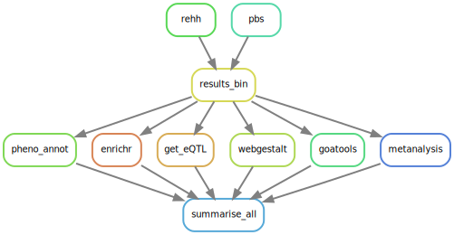

# Tese: Influência da seleção natural em populações nativas de diferentes ecorregiões americanas

### Descrição

Este repositório contém os códigos necessários para reprodução da minha tese.
Para compilar o arquivo em pdf da tese, ou visualizar o pdf já compilado, favor verificar o repositório https://github.com/cmcouto-silva/tese_latex.

### Requerimentos

Dado os múltiplos softwares e bibliotecas necessárias para gerar todos os resultados da tese, a maneira mais prática de lidar com estas dependências sem alterar diretamente o sistema operacional é através de *containers*. 
Aqui, forneço duas opções de containers, tanto via [Docker](https://hub.docker.com/repository/docker/cmcoutosilva/tese) quanto via [Conda](https://docs.conda.io/en/latest/). Para o gerenciamento do fluxo de trabalho (workflow) foi utilizado [Snakemake](https://snakemake.readthedocs.io/en/stable/).

Para instalar o Snakemake, recomenda-se instalar primeiramente o Miniconda ([vide aqui](https://docs.conda.io/en/latest/miniconda.html) como instalar o Miniconda).

Uma vez instalado o Miniconda, crie um novo ambiente virtual para Snakemake com o seguinte comando:

```bash
conda create -c conda-forge -c bioconda -n snakemake snakemake singularity -y
```

### Executando o Workflow



Para executar o workflow, ative o ambiente virtual criado para rodar o Snakemake:

    conda activate snakemake

Em seguida, podemos executar o workflow via Docker (necessário a instalação do Docker):

    snakemake -j1 --use-singularity

ou via Conda:

```
snakemake -j1 --use-conda --until setup_env
snakemake -j1 --use-conda
```

**Nota:** Recomenda-se que substitua o parâmetro `j1` por um número maior de núcleos, como, por exemplo, `-j11` (todos os testes que realizei foi com este parâmetro). Ao possibilitar o uso de múltiplas _threads_, Snakemake configura automaticamente o workflow para ser computado com pararelização.

Para saber quantos núcleos tem disponível no seu computador, no ambiente virtual do Snakemake, execute o seguinte comando:

    python -c "import multiprocessing; print(multiprocessing.cpu_count())"

### Resultados

Todas as figuras e tabelas resultantes deste workflow estão disponíveis no [repositório Dryad](#) referente a tese. Vale ressaltar, contudo,
que os dados de entrada (_e.g._ VCF, Plink) possuem limitações éticas e por esse motivo não estão inclusos no repositório. 

### Observações

Se for utilizar o arquivo de configuração para o ambiente conda, note que se faz necessário executar o comando `snakemake -j1 --use-conda --until setup_env` uma primeira e única vez, para a correta instalação de todas as dependências do workflow, visto que há pacotes do R não inclusos nos repositórios do Conda.

Se for utilizar o [Docker container](https://hub.docker.com/repository/docker/cmcoutosilva/tese), certifique-se de instalar o Docker primeiro.
